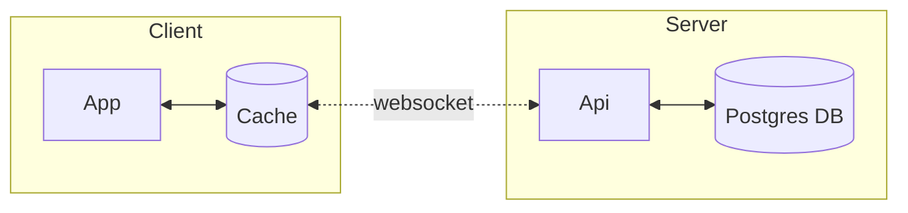
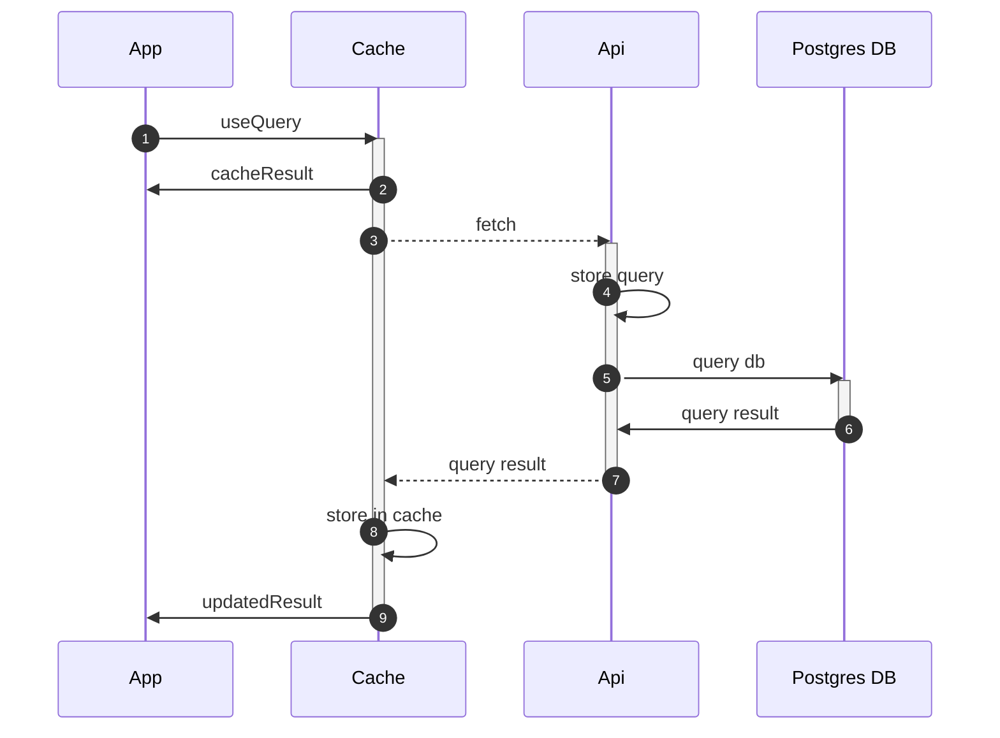
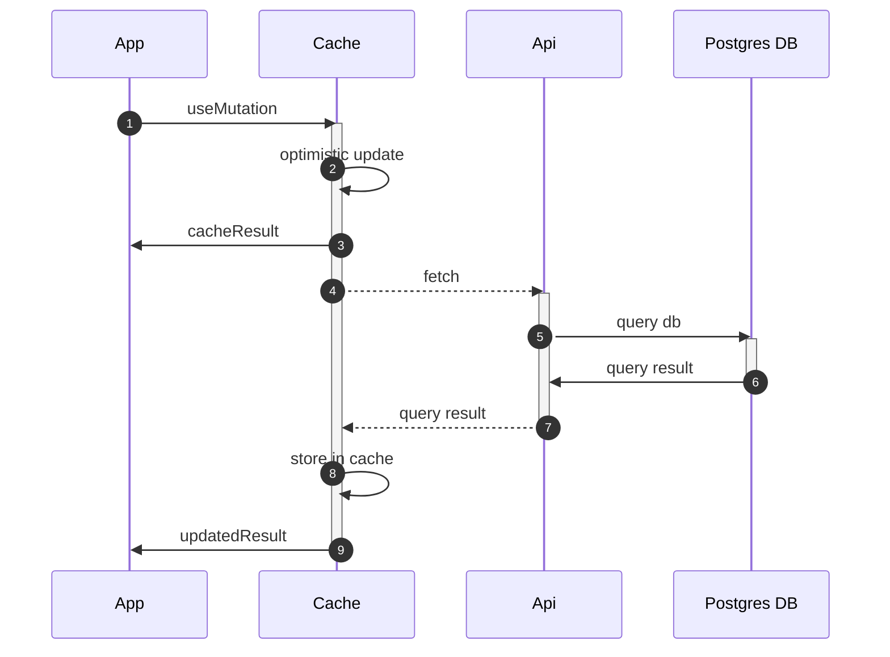
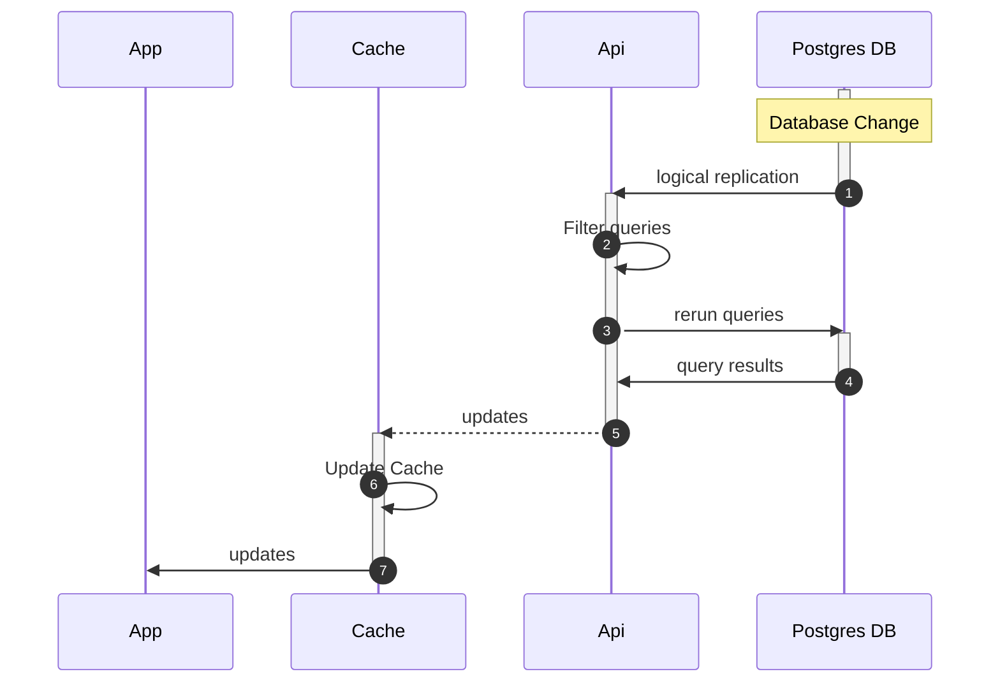

# Internal Overview

LightningDB is based around a server / client framework with a websocket linking them.

## Queries

Queries are written in the App with `useQuery`.

1. `useQuery` request.
2. A result is returned based on the data already available in the cache.
3. A fetch is made across the websocket.
4. The query is stored in the Api, so that future updates can be made.
5. \- 6. The Postgres database is queried
6. The database result is sent across the websocket
7. The frontend cache is updated with the new data.
8. The result is updated based on the new cache data.

## Mutations

Queries are written in the App with `useMutation`.

1. `useMutation` request.
2. Optimistically update the cache with the changes.
3. Queries automatically update based on the cache changes.
4. Mutations sent across the websocket.
5. \- 6. Database updated.
6. Update results sent across the websocket.
7. Frontend cache updated with changes.
8. Queries automatically update based on the cache changes.

## Replication

1. Postgres database detects a change.
2. The list of stored queries is filtered to only those queries impacted by the change.
3. \- 4. Those queries are rerun against the postgres database.
4. The results are sent across the websocket.
5. The frontend cache is updated.
6. The cache changes update any queries relying on changed data.
