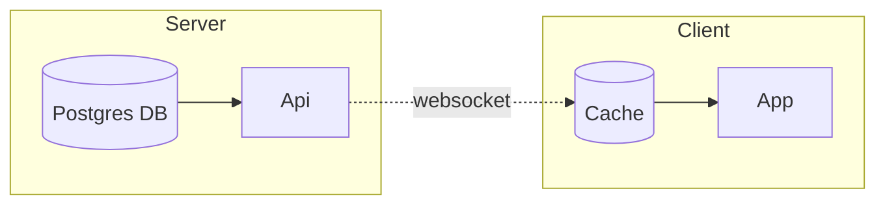
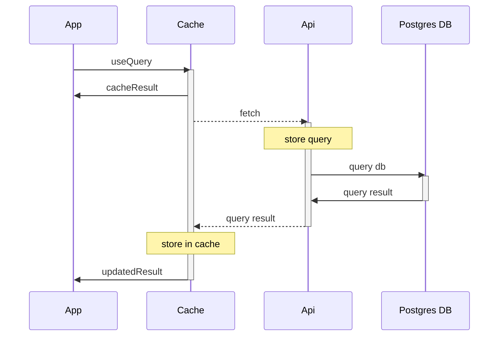
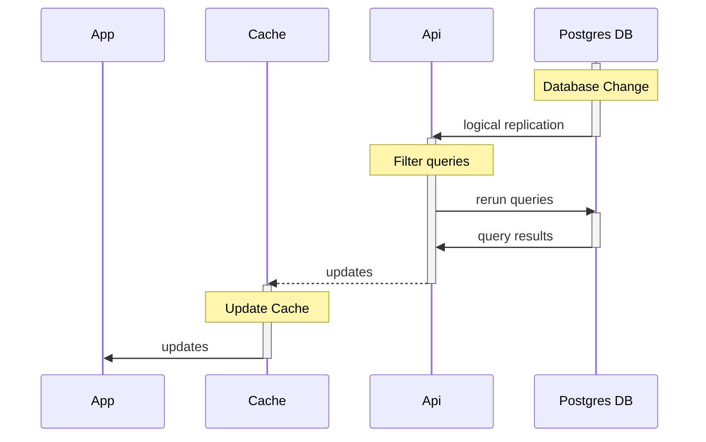

# Internal Overview

LightningDB is based around a server / client framework with a websocket linking them.

## Queries

Queries are written in the App with `useQuery`.

## Mutations

## Replication

